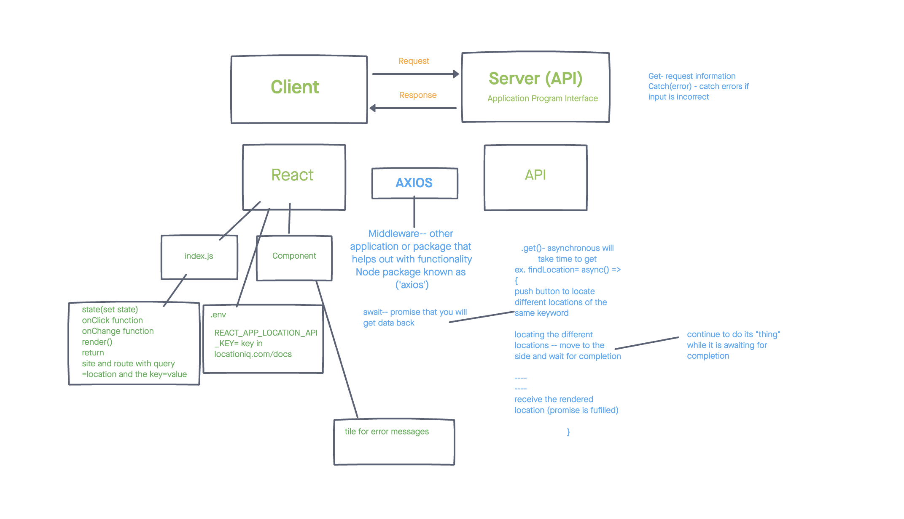

# Project Name

**Author**: Brandon Mizutani
**Version**: 1.0.0 (Trello: [City Explorer](https://trello.com/b/ENQ558B6/city-explorer-api) | Netlify: [City Explorer](https://mizutani-city-explorer.netlify.app/))

## Overview

This application, City Explorer, utilizes the Axios library to render user's request for location data (such as the longitude and latitude and a map) from LocationIQ (third-party API)

## Getting Started

Step 1: **WhiteBoard**- 

Step 2: create react app then a repo and merge them together

Step 3: npm i react-bootstrap/Axios/

Step 4: Set up LocationIQ account and copy key

Step 5: create a skeleton exterior code (ie constructor function, render/return, header and footer components)/create .env file with key and value

Step 6: copy from bootstrap favored styled elements (I used container, row, and col)

Step 7: refer to notes to create a form/submit.

Step 8: Create a variable to pass the url to the api key name and the value. Add await response feature.

Step 9:

## Architecture

- LocationIQ.com (api)
- Bootstrap
- JavaScript
- State and Props

## Change Log
10/06/21 8pm - Finished with Lab 6 (created an Application that utilizes API)

## Credit and Collaborations
JP Jones
Jae Loney

## Retrospective Lab 06

  Estimate of time needed to complete: 4 hours

  Start time: 3:20pm

  Finish time: 8pm

  Actual time needed to complete: 5 hours

1. What went well, that I might forget if I don’t write down?
  The lab was very difficult! City Explorer wasn't easy, but one of things that really helped was the Trello board! Also whiteboarding the assignment today was also very helpful in figuring out where to start on the code.

2. What did I learn today?
  I learned ALOT about API's. In particular the try/catch methods.

3. What should I do differently next time?
  Setting up the locationiq on Netlify and formatting the key. That portion of my code was the most difficult to understand.

4. What still puzzles me, or what do I need to learn more about?
  If there is a way to use the API in the live server. It was a little frustrating to constantly push and merge my branches and then wait for Netlify to give the ok to merge the PR to my main branch.

1. Is the assignment complete? If not, where exactly did you leave off, and what work remains?
  Everything is complete. I would like to maybe add more CSS styling choices, but other than that it works!
